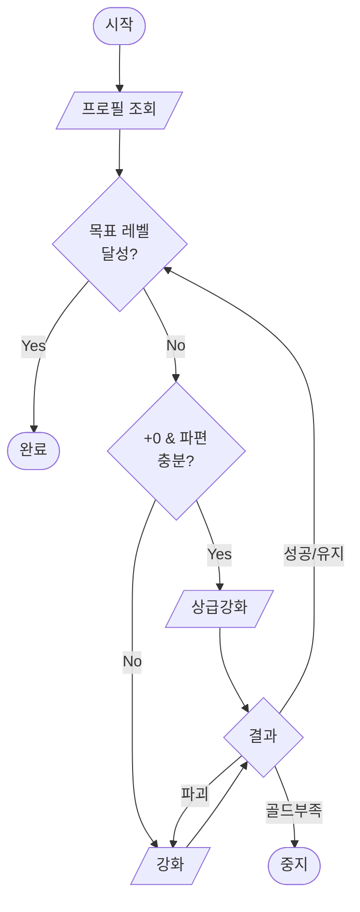
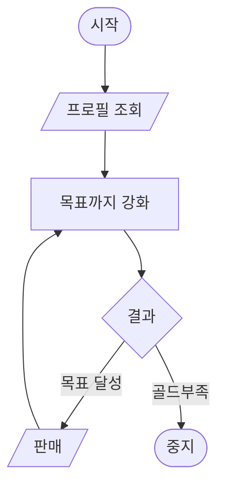
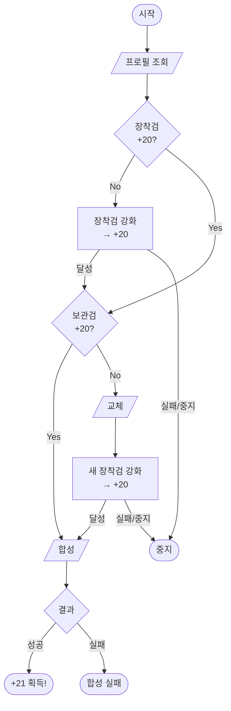

# 플레이봇 검키우기 자동 강화 매크로 v11.2.1

카카오톡 **플레이봇 검키우기** 게임 자동 강화 매크로.

카카오톡 채팅창에 게임 명령어(`@플레이봇 강화`, `@플레이봇 판매` 등)를 자동 입력하고, 채팅 로그를 읽어 결과를 파싱한 뒤 다음 행동을 결정합니다.

## 주요 기능

| 모드 | 설명 |
|---|---|
| **1. 모든 검 강화** | 현재 장착 검을 목표 강화 레벨까지 반복 강화 |
| **2. 히든 검 강화** | 히든 무기가 나올 때까지 판매→재획득 반복 후 목표까지 강화. 파괴 시 자동 재시작 |
| **3. 단순 돈벌기** | 목표까지 강화 → 판매를 무한 반복 |
| **6. 21강 만들기** | 장착검 +20 달성 → 교체 → 보관검 +20 달성 → 합성으로 +21 시도 |

## 요구 사항

- Python 3.11+
- Windows (pyautogui 기반 마우스/키보드 제어)
- 카카오톡 PC버전

```
pip install pyautogui pyperclip keyboard rich
```

## 실행

```bash
# 개발 모드
python __main__.py

# PyInstaller 빌드
pyinstaller playbot_sword_upgrade.spec
```

## 사용법

1. 카카오톡에서 플레이봇이 있는 채팅방을 엽니다.
2. 매크로를 실행하고 모드를 선택합니다.
3. 목표 강화 레벨을 입력합니다 (21강 만들기는 자동 +20).
4. 채팅 입력창을 클릭하여 좌표를 설정합니다 (ESC로 취소 가능).
5. 매크로가 자동으로 명령어를 입력하고 결과를 처리합니다.

### 단축키

| 키 | 동작 |
|---|---|
| **F3** | 강화 확률 일반/상급 전환 |
| **F8** | 일시정지 / 재개 |
| **F9** | 메뉴로 복귀 |
| **마우스 모서리** | 긴급 중지 (pyautogui failsafe) |

### 옵션 설정

메뉴에서 조정 가능:

- **최소 골드**: 이 금액 이하 시 자동 중지
- **좌표 고정**: 매번 마우스 위치를 지정하지 않고 저장된 좌표 사용
- **좌표 재설정**: 입력창을 클릭하여 좌표 재지정
- **드래그 범위**: 채팅 로그 복사 시 드래그 높이 (기본 550px)
- **응답 대기 시간**: 명령어 전송 후 응답 대기 시간 (기본 3.0초)

## 모드별 흐름도

### 1. 모든 검 강화 (TargetMode)



### 2. 히든 검 강화 (HiddenMode)


### 3. 단순 돈벌기 (MoneyMode)



### 6. 21강 만들기 (FusionMode)



## 프로젝트 구조

```
__main__.py               # 엔트리포인트 (stdio, hotkey, 메인 루프)
__init__.py               # 버전 정보 (__version__)
actions.py                # 게임 액션 (강화, 판매, 합성, 프로필 등)
parsing.py                # 채팅 로그 파서 (순수 함수, I/O 없음)
config.py                 # AppConfig 데이터클래스
state.py                  # AppState (threading.Event 기반 스레드 안전)
stats.py                  # 강화 통계 (메모리 누적, 세션 종료 시 저장)
models.py                 # WeaponState, ProfileState, ActionResult
constants.py              # 명령어/모드 상수
macro_logger.py           # Rich 기반 TUI 대시보드
weapon_catalog.py         # 무기 카탈로그 (CSV 기반 히든/일반 분류)
paths.py                  # PyInstaller 경로 해석
playbot_sword_upgrade.spec  # PyInstaller 빌드 설정
weapon_catalog.csv        # 무기 데이터 (2,400+ 항목)
chat_io/
  protocol.py             # ChatIO 추상 인터페이스
  kakaotalk.py            # pyautogui+pyperclip 구현체 (2단계 멘션 입력)
modes/
  base.py                 # BaseMode + MODE_REGISTRY 디스패치
  target.py               # 목표 강화 모드
  hidden.py               # 히든 검 강화 모드
  money.py                # 돈벌기 모드
  fusion.py               # 21강 합성 모드
ui/
  menu.py                 # 콘솔 메뉴
tests/
  conftest.py             # FakeChatIO + 공유 픽스처
  test_parsing.py         # 파서 단위 테스트
  test_parsing_fixtures.py  # 실제 카톡 메시지 기반 테스트
  test_weapon_catalog.py
  test_config.py
  test_stats.py
  test_state.py           # 스레드 안전 테스트 포함
  test_actions.py
  test_modes.py
  test_fusion.py
  fixtures/
    all_messages.txt      # 실제 카톡 메시지 샘플 (테스트 데이터)
```

## 아키텍처

```
__main__.py (엔트리포인트)
  ├── ui/menu.py (사용자 입력)
  ├── modes/* (모드 실행)
  │     └── actions.py (게임 액션 조합)
  │           └── chat_io/kakaotalk.py (실제 I/O)
  │           └── chat_io/protocol.py (추상 인터페이스)
  ├── parsing.py (순수 함수 파서)
  ├── config.py / state.py / stats.py
  └── weapon_catalog.py
```

- **모든 비즈니스 로직은 `ChatIO` 인터페이스를 통해 I/O와 분리**되어 있어, `FakeChatIO`로 pyautogui 없이 단위 테스트 가능.
- **모드 추가**는 `@register_mode` 데코레이터로 클래스 1개만 작성하면 자동 등록.
- **강화 통계**는 메모리에 누적되다가 세션 종료 시 `enhance_stats.json`에 한 번만 저장.

## 테스트

```bash
pip install pytest
python -m pytest tests/ -v
```

163개 테스트 커버:
- 채팅 로그 파싱 (실제 카톡 메시지 기반)
- 무기 카탈로그 히든/일반 분류
- 설정 로드/저장 라운드트립
- 강화 통계 메모리 누적 + flush
- `AppState` 스레드 안전 (동시 접근, 일시정지/재개)
- `GameActions` + `FakeChatIO` 통합 테스트
- 합성 모드 파싱/액션

## 설정 파일

| 파일 | 위치 | 용도 |
|---|---|---|
| `sword_config.json` | 실행 파일 옆 | 사용자 설정 (자동 생성) |
| `enhance_stats.json` | 실행 파일 옆 | 누적 강화 확률 통계 |
| `weapon_catalog.csv` | 번들 내장 | 무기 이름→종류 매핑 |

## Windows Sandbox 실행

격리 환경에서 실행하려면 `sandbox.wsb`를 직접 작성하세요.

### sandbox.wsb 템플릿

```xml
<Configuration>
    <vGpu>Enable</vGpu>
    <MappedFolders>
        <MappedFolder>
            <HostFolder>C:\your\path\to\dist</HostFolder>
            <SandboxFolder>C:\Users\WDAGUtilityAccount\Desktop\PlaybotMacro</SandboxFolder>
            <ReadOnly>false</ReadOnly>
        </MappedFolder>
    </MappedFolders>
    <LogonCommand>
        <Command>C:\Users\WDAGUtilityAccount\Desktop\PlaybotMacro\startup.cmd</Command>
    </LogonCommand>
</Configuration>
```

### 사전 준비

1. `dist/` 폴더에 [카카오톡 설치 파일](https://www.kakaocorp.com/page/service/service/KakaoTalk)(`KakaoTalk_Setup.exe`)을 다운로드
2. 템플릿의 `<HostFolder>`를 실제 `dist/` 폴더 경로로 수정하여 `sandbox.wsb`로 저장

### 실행 흐름

1. `sandbox.wsb` 더블클릭 → 샌드박스 시작
2. 카카오톡 설치가 자동 실행됨
3. 설치 완료 후 매크로가 자동 실행됨 (왼쪽 절반 배치)
4. 카카오톡 로그인 → 채팅방 열기 → 매크로 사용

## 원본 출처

이 프로젝트는 [KEY의 일기장](https://blog.naver.com/ableyoung/224132261950)에서 공유된 `검키우기_통합판v10.2.py` 소스코드를 기반으로 개발되었습니다.
